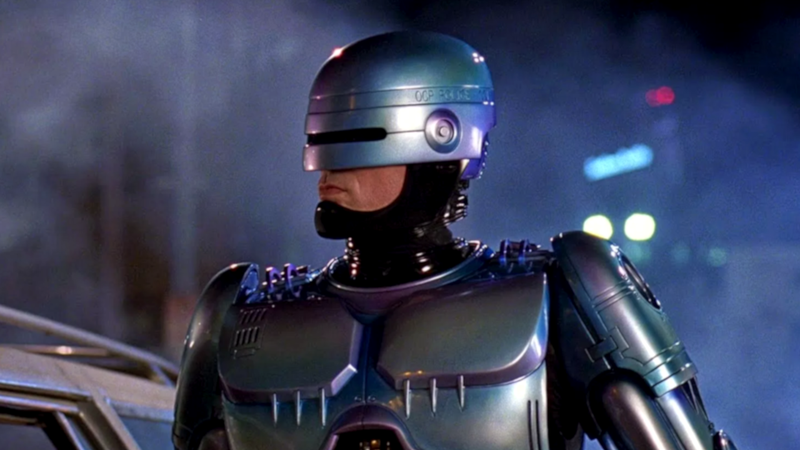
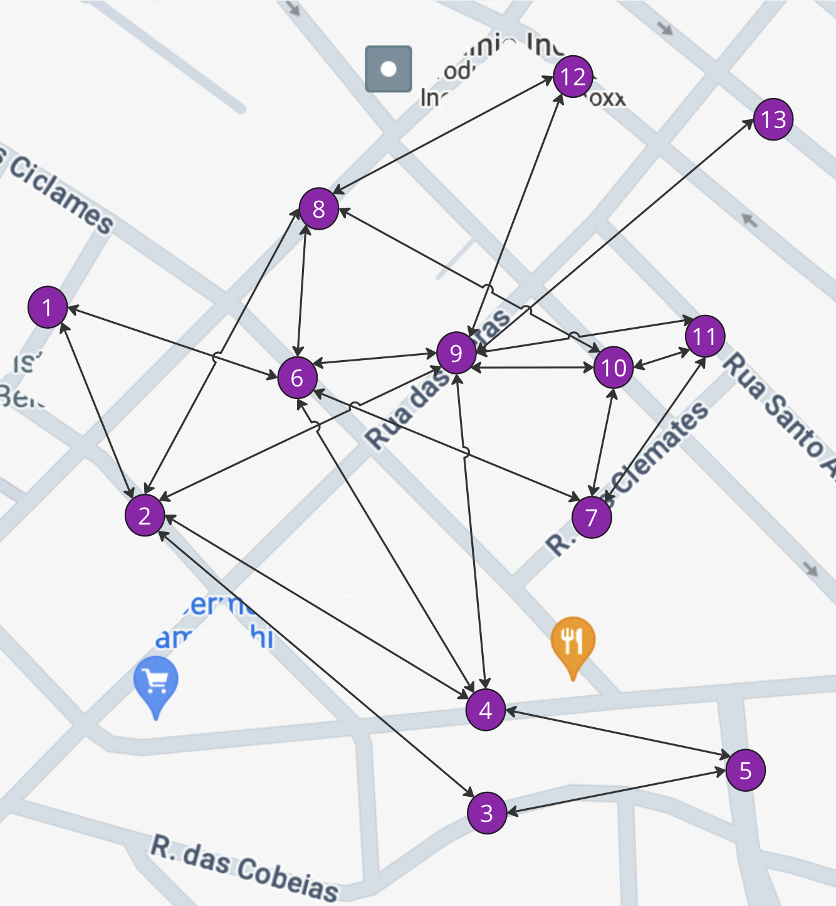
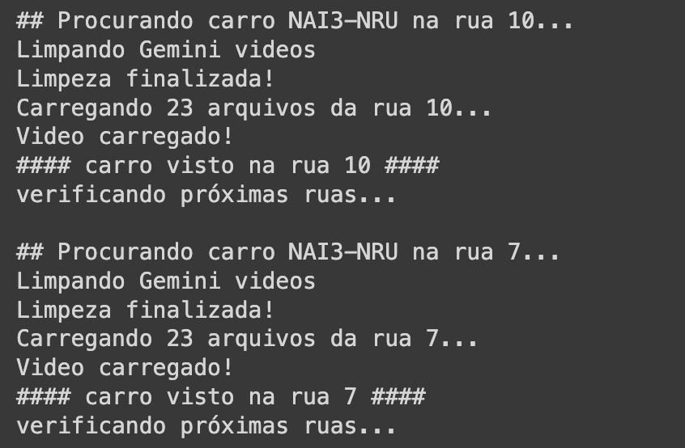
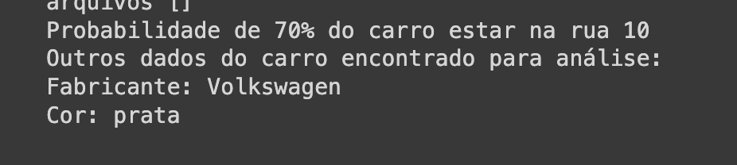

# Robocop AI
<picture>
 <source media="(prefers-color-scheme: dark)" srcset="robocop.png">
 <source media="(prefers-color-scheme: light)" srcset="robocop.png">
 
</picture>

> Robocop em referência ao filme onde o personagem é um policial humanoide e IA pois aqui ao invés de um humanoide o "policial" é uma IA.

## O projeto
Esse é um projeto em uma versão inicial para testar alguns conceitos e a partir deste ponto podendo evoluir para um projeto mais robusto.

O Robocop AI utiliza a inteligência artificial (AI) generativa do Google, a Gemini, para analisar vídeos de câmeras de segurança pública instaladas nas ruas e identificar se um carro (roubado) passou por ali. A partir deste resultado é possível utilizando serviços de localização saber quais são as possíveis próximas ruas e analisando as câmeras de cada uma traçar a rota do veículo descobrindo o paradeiro atual.

> [!NOTE]
> A ideia é que este projeto seja utilizado por autorizades de segurança e não para a população em geral por conter dados pessoais como carro, placas e até mesmo a imagem dos motoristas, além de evitar que o seu uso ser deturpado, como localizar uma pessoa sem o consentimento desta.

Esta primeira versão conta com vídeos grátis de ruas de bancos de imagens (vídeos) simulando uma gravação real de uma rua.
Os vídeos usados são os seguintes:
- [vídeo 1](http://www.onsave.com.br/cdn/streets/1/video.mp4)
- [vídeo 2](http://www.onsave.com.br/cdn/streets/4/video.mp4)
- [vídeo 3](http://www.onsave.com.br/cdn/streets/9/video.mp4)

Além disso, como um projeto piloto, ainda não está integrado com um serviço de geolocalização, como o Google Maps. Ao invés disso existe um grafo simulando as ruas de uma pequena cidade:

## Uso
Esse protótipo utiliza Jupyter Notebook do Python, onde você pode executar a partir da sua máquina ou através do Colab do Google em: 
[Robocop AI Colab project](https://colab.research.google.com/github/flaviochess/robocop_ai/blob/main/robocop.ipynb)

A última função recebe dois atributos, sendo uma placa de carro e uma rua (de 1 à 13 como o mapa acima). Ao rodar ela você pode observar toda a busca ocorrendo pelas ruas até encontrar o carro.

## Limitações
O uso free do Gemini contém algumas limitações como limite de uso diário ou rate limite. Por isso é possível encotrar alguns try...except no código para evitar que a experiência do usuário quebre.
